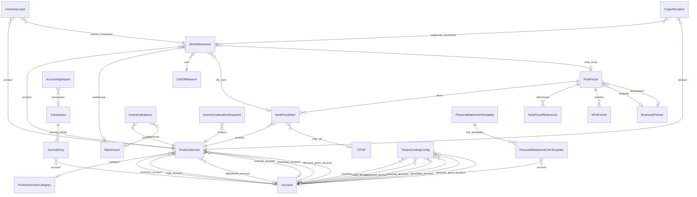
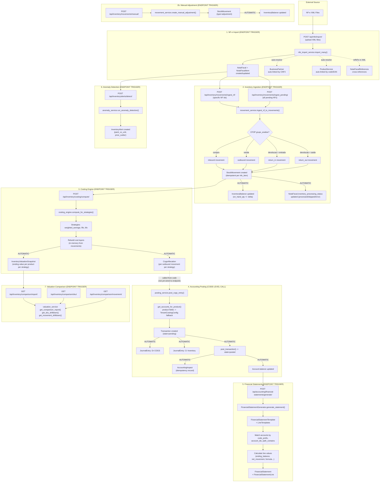

# Inventory Management System — Complete Manual

## 1. Model Overview and Relationships

### 1.1 Core Domain Models

#### Billing App (Source Data)

| Model | Purpose |
|-------|---------|
| **ProductService** | Master catalog of products and services. `item_type` = "product" or "service". Products with `track_inventory=True` participate in inventory tracking. Holds 6 account FKs for accounting integration. |
| **ProductServiceCategory** | Hierarchical (MPTT) product categorization. |
| **BusinessPartner** | Clients, vendors, or both. Linked to NF-e emitente/destinatario. |
| **NotaFiscal** | Brazilian electronic invoice (NF-e). The primary source document for inventory movements. Contains totals, taxes, emitter/recipient data, SEFAZ status, and `inventory_processing_status`. |
| **NotaFiscalItem** | Line items on an NF-e. Each has quantity, unit price, CFOP, NCM, tax breakdowns, and an optional FK to `ProductService`. |
| **NotaFiscalReferencia** | Cross-references between NF-e documents (e.g., a return referencing the original sale). |
| **NFeEvento** | Events on an NF-e: cancellations (110111), correction letters (110110), recipient manifestations (210200-210240). |
| **Invoice / InvoiceLine** | Internal invoices (sale/purchase). Not yet connected to inventory posting. |
| **CFOP** | Brazilian fiscal operation codes. `grupo_analise` determines movement type (compra, venda, devolucao, etc.). |

#### Inventory App (Core)

| Model | Purpose |
|-------|---------|
| **Warehouse** | Storage locations. Optional for single-location tenants. |
| **UnitOfMeasure** | Units (UN, KG, CX, M2, etc.). |
| **UoMConversion** | Conversion factors between UoMs. Can be global or product-specific. |
| **StockMovement** | Immutable audit log of every inventory movement. Types: `inbound`, `outbound`, `adjustment`, `return_in`, `return_out`. Idempotent via `idempotency_key`. |
| **InventoryLayer** | Cost layers for FIFO/LIFO costing. Each inbound movement creates a layer with `original_qty`, `remaining_qty`, `unit_cost`. |
| **InventoryBalance** | Denormalized on-hand quantity per product per warehouse. Updated on every movement. |

#### Inventory App (Costing & Accounting)

| Model | Purpose |
|-------|---------|
| **TenantCostingConfig** | Per-company configuration: primary strategy, enabled strategies, negative inventory policy, and 6 default account FKs. |
| **InventoryValuationSnapshot** | Point-in-time valuation per strategy + product + warehouse. Enables side-by-side comparison. |
| **CogsAllocation** | COGS computation result per outbound movement per strategy. Records which layers were consumed at what cost. |
| **AccountingImpact** | Idempotent record that a journal entry was posted. Prevents duplicate postings. Links to `accounting.Transaction`. |
| **InventoryAlert** | Anomaly alerts: pack-vs-unit mismatches, price outliers, negative stock, stale inventory. |

#### Accounting App (Destination)

| Model | Purpose |
|-------|---------|
| **Account** | Chart of accounts (hierarchical MPTT). Has `account_code`, `account_direction` (debit/credit normal), `balance`. |
| **Transaction** | Accounting transaction header. Has date, entity, description, amount, state (pending/posted). |
| **JournalEntry** | Individual debit/credit line within a transaction. Links to Account. |
| **FinancialStatementTemplate** | Defines report structure (Balance Sheet, Income Statement, Cash Flow, etc.). |
| **FinancialStatementLineTemplate** | Maps accounts to report lines using `account_code_prefix`, `account_ids`, or `account_path_contains`. Supports calculation methods: ending_balance, net_movement, formula, rollup, etc. |
| **FinancialStatement / FinancialStatementLine** | Generated statement instance with computed values. |

### 1.2 Entity Relationship Diagram



---

## 2. The Six Product Account Fields

Each `ProductService` can define account overrides. When blank, the system falls back to `TenantCostingConfig` defaults.

| Field | Statement | Nature | When Debited | When Credited |
|-------|-----------|--------|-------------|---------------|
| `inventory_account` | Balance Sheet (Asset) | Current Asset | Goods received (purchase/inbound) | Goods sold/consumed (COGS posting) |
| `cogs_account` | Income Statement (Expense) | Expense | Sale recognized (cost side) | — |
| `adjustment_account` | Income Statement (Expense/Loss) | Expense | Write-downs, shrinkage, period-close adjustments | Write-ups (rare) |
| `revenue_account` | Income Statement (Revenue) | Revenue | — | Sale recognized (revenue side) |
| `purchase_account` | Income Statement or transitory | Expense/Asset | Goods purchased | Cleared to inventory (perpetual) |
| `discount_given_account` | Income Statement (Contra-revenue) | Contra-revenue | Discount applied to customer | — |

### Account Resolution Priority

```
ProductService.{account_field}   -- product-level override
        |
        v  (if null)
TenantCostingConfig.{account_field}  -- company default
```

### Impact on Financial Statements

**Balance Sheet (Balanço Patrimonial):**

- `inventory_account` balance = total cost of unsold inventory on hand

**Income Statement (DRE):**

```
  Gross Revenue           <-- revenue_account (credit balances)
- Discounts Given         <-- discount_given_account (debit balances)
- Taxes on Revenue
= Net Revenue
- COGS                    <-- cogs_account (debit balances)
= Gross Profit
- Inventory Adjustments   <-- adjustment_account (debit balances)
- Operating Expenses
= Operating Income
```

**Connection to FinancialStatementTemplate:** Each `FinancialStatementLineTemplate` selects accounts via `account_code_prefix` or `account_ids`. When products post to the correct accounts, those balances automatically flow into the right lines of the generated financial statement. E.g., a line template with `account_code_prefix = "3.01.01"` (COGS) will sum all journal entries posted to accounts with that prefix — which includes the COGS entries created by the inventory posting service.

---

## 3. Complete Data Flow

### 3.1 Flowchart



### 3.2 Step-by-Step Narrative

#### Step 1: NF-e Import — `POST /{tenant}/api/nfe/import/`

- **Trigger:** Endpoint (user uploads XML files)
- **Service:** `billing.services.nfe_import_service.import_many()`
- **What happens:**
  - Parses XML, creates `NotaFiscal` + `NotaFiscalItem` records
  - Auto-links `BusinessPartner` by CNPJ and `ProductService` by code/EAN
  - Creates `NotaFiscalReferencia` for return/complementary NF cross-references
  - Sets `inventory_processing_status = "pending"` (ready for ingestion)
- **Automatic side effects:** None on inventory yet

#### Step 2: Inventory Ingestion — `POST /{tenant}/api/inventory/movements/ingest_nf/` or `ingest_pending/`

- **Trigger:** Endpoint (explicit call required)
- **Service:** `inventory.services.movement_service.ingest_nf_to_movements()`
- **What happens:**
  - Iterates NF-e items where `produto.item_type == "product"` and `produto.track_inventory == True`
  - Determines movement type from CFOP `grupo_analise` + `tipo_operacao`
  - Resolves UoM and applies conversions if needed
  - Creates `StockMovement` (idempotent via `nfe_item:{id}` key)
  - **Automatic:** Updates `InventoryBalance.on_hand_qty`
  - **Automatic:** Updates `NotaFiscal.inventory_processing_status`
- **Filtering rules (items skipped):**
  - `no_product`: NF item not linked to a ProductService
  - `not_product_type`: ProductService.item_type is "service"
  - `track_inventory_disabled`: ProductService.track_inventory is False
  - `already_processed`: StockMovement already exists for this NF item

#### Step 2b: Manual Adjustment — `POST /{tenant}/api/inventory/movements/manual/`

- **Trigger:** Endpoint
- **Service:** `inventory.services.movement_service.create_manual_adjustment()`
- **What happens:** Creates `StockMovement` (type=adjustment), updates `InventoryBalance`

#### Step 3: Costing Computation — `POST /{tenant}/api/inventory/costing/compute/`

- **Trigger:** Endpoint (explicit call required)
- **Service:** `inventory.services.costing_engine.compute_for_strategies()`
- **What happens:**
  - For each enabled strategy (weighted_average, fifo, lifo):
    1. `rebuild_layers()` — reconstructs cost layers from all movements
    2. `allocate_cogs()` — assigns cost to each outbound movement
    3. `value_ending_inventory()` — computes on-hand value
  - **Automatic:** Upserts `CogsAllocation` records
  - **Automatic:** Upserts `InventoryValuationSnapshot` records

#### Step 4: Accounting Posting — **Not yet wired to an endpoint**

- **Trigger:** Code-level call (must be invoked programmatically)
- **Service:** `inventory.services.posting_service.post_cogs_entry()`
- **What happens:**
  - Resolves accounts: `product.{account} or config.{account}`
  - Creates `Transaction` + 2 `JournalEntry` records (Dr COGS / Cr Inventory)
  - Validates balance, posts transaction
  - **Automatic:** Creates `AccountingImpact` (idempotency)
  - **Automatic:** Account balances updated via `post_transaction()`
- **Currently wired accounts:** `inventory_account`, `cogs_account`, `adjustment_account`
- **Not yet wired:** `revenue_account`, `purchase_account`, `discount_given_account` (ready for invoice-to-journal posting)

#### Step 5: Financial Statement Generation — `POST /{tenant}/api/accounting/financial-statements/generate/`

- **Trigger:** Endpoint
- **Service:** `accounting.services.financial_statement_service.FinancialStatementGenerator`
- **What happens:**
  - Takes a `FinancialStatementTemplate` and date range
  - For each line template, selects accounts by `account_code_prefix`, `account_ids`, or `account_path_contains`
  - Calculates values using the configured method (ending_balance for Balance Sheet, net_movement for Income Statement, etc.)
  - **Key connection to inventory:** The journal entries posted in Step 4 affect Account balances, which are read here. If a product's `cogs_account` has code "3.01.01" and the DRE template has a line with `account_code_prefix = "3.01"`, all COGS postings flow into the COGS line automatically.
  - Generates `FinancialStatement` + `FinancialStatementLine` records

#### Step 6: Anomaly Detection — `POST /{tenant}/api/inventory/alerts/detect/`

- **Trigger:** Endpoint
- **Service:** `inventory.services.anomaly_service.run_anomaly_detection()`
- **What happens:** Analyzes NF-e item prices for pack-vs-unit mismatches and statistical outliers. Creates `InventoryAlert` records.

#### Step 7: Valuation Comparison Reports — `GET /{tenant}/api/inventory/comparison/{report|sku|movement}/`

- **Trigger:** Endpoint (read-only)
- **Service:** `inventory.services.valuation_service`
- **What happens:** Reads `InventoryValuationSnapshot` and `CogsAllocation` to show side-by-side COGS and ending inventory differences across strategies.

---

## 4. Complete API Endpoint Reference

### Billing App (`/{tenant}/api/...`)

| Method | Endpoint | Trigger Type | Purpose |
|--------|----------|--------------|---------|
| POST | `/api/nfe/import/` | Manual | Upload NF-e XMLs |
| GET | `/api/nfe/` | Read | List Notas Fiscais |
| GET | `/api/nfe/{id}/` | Read | NF detail |
| GET | `/api/nfe/resumo/` | Read | Aggregated NF summary |
| GET | `/api/nfe/analises/?tipo=...` | Read | NF analytics (by status, UF, timeline, taxes, etc.) |
| GET | `/api/nfe/canceladas/` | Read | Cancelled NFs |
| GET | `/api/nfe/com-cce/` | Read | NFs with correction letters |
| GET | `/api/nfe/manifestacao/` | Read | Recipient manifestation stats |
| GET | `/api/nfe/{id}/timeline/` | Read | Event timeline for an NF |
| GET/PUT | `/api/product_services/` | CRUD | Product/Service master data |
| GET/PUT | `/api/invoices/` | CRUD | Invoices |
| GET/PUT | `/api/invoice_lines/` | CRUD | Invoice lines |

### Inventory App (`/{tenant}/api/inventory/...`)

| Method | Endpoint | Trigger Type | Purpose |
|--------|----------|--------------|---------|
| POST | `/movements/ingest_nf/` | Manual | Ingest specific NFs to movements |
| POST | `/movements/ingest_pending/` | Manual | Ingest all pending NFs |
| POST | `/movements/manual/` | Manual | Create manual adjustment |
| GET | `/movements/` | Read | List stock movements |
| GET | `/balances/` | Read | Current inventory balances |
| POST | `/costing/compute/` | Manual | Run costing engine |
| GET | `/comparison/report/` | Read | Strategy comparison report |
| GET | `/comparison/sku/` | Read | Per-product strategy drilldown |
| GET | `/comparison/movement/` | Read | Per-movement layer drilldown |
| POST | `/alerts/detect/` | Manual | Run anomaly detection |
| GET/PATCH | `/alerts/` | Read/Update | View/acknowledge/resolve alerts |
| CRUD | `/warehouses/` | CRUD | Warehouse management |
| CRUD | `/uom/` | CRUD | Units of measure |
| CRUD | `/uom-conversions/` | CRUD | UoM conversion factors |

---

## 5. Costing Strategies

Three built-in strategies are registered via a pluggable registry (`inventory/strategies/`):

| Strategy | Key | How COGS is Allocated |
|----------|-----|------------------------|
| **Weighted Average** | `weighted_average` | Running average cost across all layers. Each outbound uses the current average unit cost. |
| **FIFO** | `fifo` | First In, First Out. Oldest layers consumed first. |
| **LIFO** | `lifo` | Last In, First Out. Newest layers consumed first. |

`TenantCostingConfig.primary_strategy` determines which strategy is used for official reporting (journal entries). All enabled strategies can be computed for comparison.

---

## 6. What Is Automatic vs. What Requires a Trigger

| Step | Automatic? | Trigger |
|------|------------|---------|
| NF-e XML parsing and storage | No | `POST /api/nfe/import/` |
| BusinessPartner/Product auto-linking on import | **Yes** (during import) | Part of NF-e import |
| NF-e to StockMovement ingestion | No | `POST /api/inventory/movements/ingest_nf/` or `ingest_pending/` |
| InventoryBalance update on movement | **Yes** (during ingestion) | Automatic when StockMovement is created |
| NotaFiscal.inventory_processing_status update | **Yes** (during ingestion) | Automatic when NF processed |
| UoM conversion during ingestion | **Yes** (during ingestion) | Automatic if UoMConversion exists |
| InventoryLayer creation | **Yes** (during costing) | Part of strategy `rebuild_layers()` |
| CogsAllocation computation | No | `POST /api/inventory/costing/compute/` |
| InventoryValuationSnapshot creation | **Yes** (during costing) | Part of `compute_for_strategies()` |
| COGS journal entry posting | No | Code-level call to `post_cogs_entry()` (no endpoint yet) |
| Transaction balance validation | **Yes** (during posting) | Part of `post_cogs_entry()` |
| Account balance update | **Yes** (during posting) | Part of `post_transaction()` |
| AccountingImpact idempotency record | **Yes** (during posting) | Part of `post_cogs_entry()` |
| Financial statement generation | No | `POST /api/accounting/financial-statements/generate/` |
| Anomaly detection | No | `POST /api/inventory/alerts/detect/` |
| Period-close adjustments | No | Not yet implemented (placeholder in `post_period_close_adjustments()`) |

---

## 7. Gap Analysis: What Is Not Yet Wired

1. **Posting service has no endpoint** — `post_cogs_entry()` exists but must be called programmatically. No REST endpoint triggers it yet.

2. **Revenue/Purchase/Discount posting not implemented** — The `revenue_account`, `purchase_account`, and `discount_given_account` fields are defined on the model but no service creates journal entries using them. This would require an invoice-to-journal posting service.

3. **Period-close adjustments are a placeholder** — `post_period_close_adjustments()` returns "not_implemented" for all strategies.

4. **Invoice model not connected to inventory** — The `Invoice`/`InvoiceLine` models exist but have no link to stock movements or accounting posting. Currently, all inventory flow comes through NF-e documents.

5. **No automatic trigger chain** — Each step (import → ingest → cost → post → report) requires a separate endpoint call. There is no signal or Celery task that chains them automatically.
