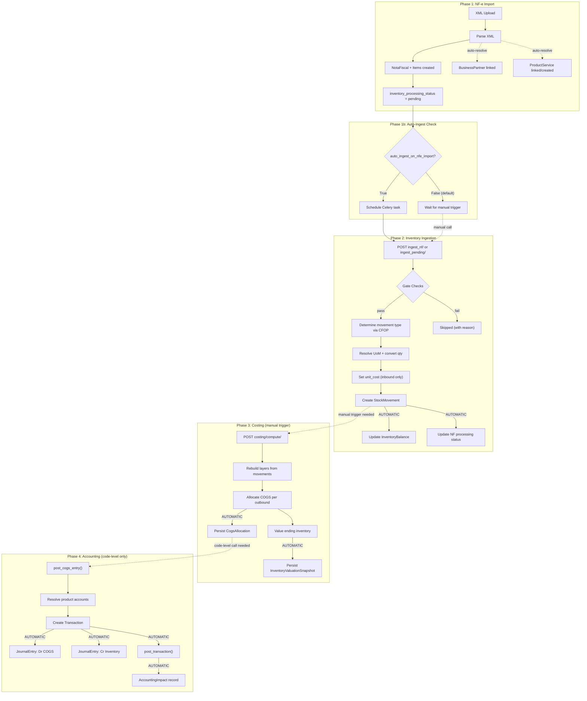

# NF-e to Inventory: Complete Walkthrough and Improvement Roadmap

## What Happens Today When You Add NF-e XMLs

### Phase 1: XML Upload and Parsing

**Endpoint:** `POST /{tenant}/api/nfe/import/` (upload `.xml` files)

The entry point is `import_nfe_xml_many()` in `billing/services/nfe_import_service.py`. For each uploaded file it:

1. Detects the document type (NFe, evento, inutilizacao) via `detect_nfe_document_type()`
2. For NFe documents, calls `import_one()` which:
   - Parses the XML via `parse_nfe_xml()`
   - Creates a **NotaFiscal** record with all header data (emitente, destinatario, totals, taxes, SEFAZ protocol)
   - Creates **NotaFiscalItem** records for each line item with qty, unit price, CFOP, NCM, tax breakdowns
   - Auto-resolves **BusinessPartner** by CNPJ (`_resolve_parceiro()`)
   - Auto-resolves **ProductService** by code/EAN (`_resolve_produto()`) — and **creates new products** if no match is found, defaulting to `item_type="product"`
   - Creates **NotaFiscalReferencia** records for cross-referenced NFs (e.g., returns referencing originals)
   - Sets `inventory_processing_status = "pending"`

**What happens to Inventory at this point: Nothing yet.** The NF is stored but no stock movements exist.

### Phase 1b: Optional Auto-Ingestion

At the end of `import_nfe_xml_many()`, if `TenantCostingConfig.auto_ingest_on_nfe_import` is `True`, it schedules a Celery task on commit:

```python
transaction.on_commit(
    lambda ids=nf_ids, cid=company.id: _schedule_inventory_ingest(cid, ids)
)
```

This fires `ingest_nf_movements_task` asynchronously, which calls the same ingestion function described in Phase 2. **By default this is OFF** (`auto_ingest_on_nfe_import = False`).

### Phase 2: NF-e to Stock Movements

**Endpoint:** `POST /{tenant}/api/inventory/movements/ingest_nf/` or `ingest_pending/`

The service `ingest_nf_to_movements()` in `inventory/services/movement_service.py` runs through each NF item inside a single atomic transaction.

#### Gate Checks (per item)

| Check | What happens if it fails |
|-------|--------------------------|
| `item.produto` exists? | Tries fallback lookup by code/EAN. If still no match: **skipped** (`no_product`) |
| `product.item_type == "product"`? | **Skipped** (`not_product_type`) — services are excluded |
| `product.track_inventory == True`? | **Skipped** (`track_inventory_disabled`) |
| Idempotency key `nfe_item:{id}` already exists? | **Skipped** (`already_processed`) |

#### If All Checks Pass

1. **Determines movement type** via CFOP `grupo_analise`:
   - `compra` -> `inbound`
   - `venda` -> `outbound`
   - `devolucao` + entrada -> `return_in`
   - `devolucao` + saida -> `return_out`
   - `outros` -> uses `tipo_operacao` (0=inbound, 1=outbound)

2. **Resolves UoM**: Gets or creates a `UnitOfMeasure` from the NF item's `unidade` field

3. **Converts quantity**: If a `UoMConversion` exists (product-specific first, then global), converts to base UoM

4. **Sets unit_cost**: Only for inbound-like movements (`valor_unitario` from the NF item). Outbound movements get `unit_cost = None` — to be filled later by costing.

5. **Creates StockMovement**: Immutable record with full traceability back to `nfe_item` and `nota_fiscal`

6. **Updates InventoryBalance**: Adds or subtracts the delta from `on_hand_qty` — this is the real-time on-hand count

7. **Updates NF status**: Sets `inventory_processing_status` to processed / all_skipped / error

### Phase 3: Costing Engine (separate manual trigger)

**Endpoint:** `POST /{tenant}/api/inventory/costing/compute/`

`compute_for_strategies()` in `inventory/services/costing_engine.py`:

1. Loads all movements in date range
2. For each strategy (weighted_average, fifo, lifo):
   - `rebuild_layers()` — reconstructs cost layers from movements in memory
   - `allocate_cogs()` — assigns cost to each outbound movement
   - `value_ending_inventory()` — computes remaining inventory value
3. Persists **CogsAllocation** (cost per outbound movement) and **InventoryValuationSnapshot** (ending value per product)

### Phase 4: Accounting Posting (no endpoint, code-level only)

`post_cogs_entry()` in `inventory/services/posting_service.py`:

- Creates a **Transaction** with two **JournalEntry** records (Dr COGS / Cr Inventory)
- Resolves accounts from `product.{account}` falling back to `TenantCostingConfig.{account}`
- Creates **AccountingImpact** for idempotency
- These journal entries affect Account balances, which feed into financial statement generation

---

## Visual Flow



---

## What We Could Be Doing Better

### 1. No inventory layer creation during ingestion

**Current:** When an inbound movement is created, no `InventoryLayer` is persisted. The `layer_service.create_layer_from_inbound()` function exists in `inventory/services/layer_service.py` but is **never called**. Layers are only rebuilt in-memory during costing computation.

**Problem:** There is no persistent layer state between costing runs. If the costing engine has a bug or crashes, there is no persisted layer trail. You cannot query "which layers does this product have right now?" without running the full costing engine.

**Recommendation:** Call `create_layer_from_inbound(movement)` immediately after creating an inbound `StockMovement` in `ingest_nf_to_movements()`. This gives a persistent audit trail and enables real-time layer queries.

---

### 2. No InventoryLayer consumption tracking

**Current:** `InventoryLayer.remaining_qty` is never decremented. The costing engine rebuilds layers from scratch each time.

**Recommendation:** When the costing engine allocates COGS from a layer, update `InventoryLayer.remaining_qty` and set `is_exhausted = True` when fully consumed. This makes the layer table a live view of available inventory cost layers.

---

### 3. Cancelled NFs are not handled

**Current:** If an NF-e is cancelled (evento 110111 or `status_sefaz = "101"`), the movements already created from it are **not reversed**. The ingestion service does not check for cancellations before processing, and there is no mechanism to reverse movements when a cancellation event is imported.

**Recommendation:** When a cancellation event is imported, automatically create reversal `StockMovement` records for all movements linked to that NF (`nota_fiscal` FK), decrement `InventoryBalance`, and optionally mark the original movements as reversed.

---

### 4. No inbound accounting posting (Dr Inventory / Cr Accounts Payable)

**Current:** Only COGS postings exist (Dr COGS / Cr Inventory for outbound). When goods are received (inbound), there is **no journal entry** to debit the inventory account and credit a payable/purchase account.

**Recommendation:** Add a `post_inbound_entry()` function that creates `Dr inventory_account / Cr purchase_account` when an inbound movement is created. This would use the `purchase_account` field on `ProductService`.

---

### 5. Costing is not auto-triggered after ingestion

**Current:** After ingesting NF items into movements, you must manually call the costing endpoint. The `auto_ingest_on_nfe_import` flag chains import to ingestion, but nothing chains ingestion to costing to posting.

**Recommendation:** Add an `auto_compute_costing` flag on `TenantCostingConfig`. After ingestion completes, if enabled, schedule `rebuild_and_snapshot_task` via Celery. Optionally chain `post_cogs_entry()` for each new allocation if `auto_post_primary` is `True`.

---

### 6. ProductService.stock_quantity is never synced

**Current:** `ProductService` has a `stock_quantity` field but it is **never updated** by the inventory system. The actual on-hand quantity lives in `InventoryBalance.on_hand_qty`.

**Recommendation:** Either remove the field (to avoid confusion) or sync it by summing `InventoryBalance.on_hand_qty` across warehouses whenever balances change.

---

### 7. Auto-created products lack track_inventory = True

**Current:** When `_resolve_produto()` in the NF-e import service creates a new product from an NF item, it does **not** set `track_inventory = True`. So the product will be **skipped** during inventory ingestion until someone manually enables it.

**Recommendation:** Default `track_inventory=True` for auto-created products, since they come from NF-e items and represent physical goods.

---

### 8. Single-warehouse limitation

**Current:** `_get_default_warehouse()` always picks the first active warehouse. All movements for an NF go to the same warehouse regardless of the actual storage location.

**Recommendation:** Allow warehouse mapping per BusinessPartner or per CFOP, or let the NF-e import carry warehouse hints.

---

### 9. revenue_account, purchase_account, discount_given_account are unused

**Current:** These account fields were added to `ProductService` and `TenantCostingConfig` but no service creates journal entries using them. Invoice-to-journal and purchase-to-journal posting do not exist.

**Recommendation:** Build posting functions for:
- Sales: Dr Receivable / Cr Revenue (with discount handling via `discount_given_account`)
- Purchases: Dr Inventory or Purchase / Cr Payable (using `purchase_account`)

---

### 10. Period-close adjustments are a placeholder

**Current:** `post_period_close_adjustments()` in `posting_service.py` returns "not_implemented" for every strategy.

**Recommendation:** Implement the delta computation between the primary strategy valuation and each alternative strategy, then post adjusting entries using the `adjustment_account`.

---

## Priority Matrix

| Issue | Impact | Effort | Priority |
|-------|--------|--------|----------|
| 3. Cancelled NFs not handled | **High** — incorrect balances | Medium | **P0** |
| 7. Auto-created products lack track_inventory | **High** — items silently skipped | Low | **P0** |
| 1. No layer creation during ingestion | Medium — no persistent layer trail | Low | **P1** |
| 4. No inbound accounting posting | **High** — incomplete GL | Medium | **P1** |
| 5. No auto costing after ingestion | Medium — manual step | Low | **P1** |
| 6. stock_quantity never synced | Medium — data inconsistency | Low | **P1** |
| 2. No layer consumption tracking | Medium — layers not live | Medium | **P2** |
| 9. Unused account fields | Medium — incomplete accounting | High | **P2** |
| 8. Single-warehouse limitation | Low — most tenants single-site | Medium | **P3** |
| 10. Period-close placeholder | Low — not yet needed | High | **P3** |
