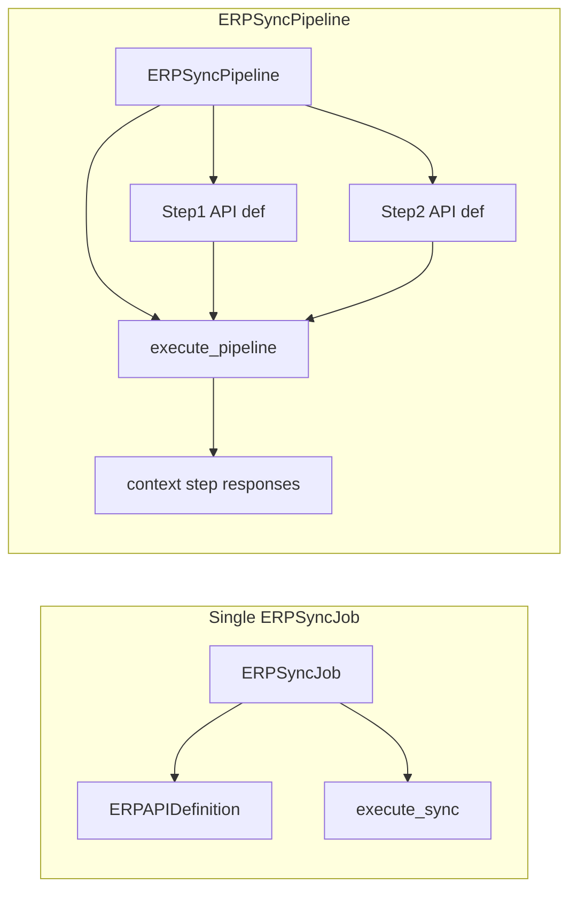

# Composite (joined) external API calls

## Current behavior (baseline)

- `**[ERPAPIDefinition](erp_integrations/models.py)**` — one Omie-style call (`call`, `url`, `param_schema`, `transform_config`, `unique_id_config`).
- `**[ERPSyncJob](erp_integrations/models.py)**` — exactly one `connection` + one `api_definition`, plus `extra_params` / `fetch_config`.
- `**[erp_integrations/services/omie_sync_service.py](erp_integrations/services/omie_sync_service.py)**` — `execute_sync(job_id, dry_run=...)` loops **pagination only** for that single `api_def`; `[build_payload](erp_integrations/services/payload_builder.py)` always uses one definition.
- **Testing today** — `[ERPSyncJobViewSet.dry_run](erp_integrations/views.py)` → `execute_sync(..., dry_run=True)` (page 1); `[BuildPayloadView](erp_integrations/views.py)` tests **one** payload from `connection_id` + `api_definition_id`.

So "joining" calls is not supported until we add an orchestration layer above `execute_sync`.

## Recommended approach: pipeline + ordered steps (keep single-call jobs intact)

Add new models (names can be adjusted) so registration mirrors "one job" mentally but steps are explicit:

1. `**ERPSyncPipeline`** (tenant-aware, like `ERPSyncJob`)
  - `connection` (FK), `name`, `is_active`, `schedule_rrule` (optional), `last_*` status fields (optional mirror of job).
  - Optional: `fetch_config` only if you want **one** date/cursor strategy for the whole pipeline; otherwise each step carries its own segment rules.
2. `**ERPSyncPipelineStep`** (ordered M2M via `order` integer)
  - `pipeline` (FK), `order`, `api_definition` (FK), `extra_params` (JSON, overrides for that step), optional `**param_template`** or `**param_bindings**` (JSON) describing how to build `param_overrides` for this step from **step outputs** (see below).

**Execution model (sequential v1):**

- New function e.g. `execute_pipeline(pipeline_id, dry_run=False)` in `[omie_sync_service.py](erp_integrations/services/omie_sync_service.py)` (or a sibling module to avoid a 600-line file growing further):
  - Create **one** `[ERPSyncRun](erp_integrations/models.py)`-like audit row **or** extend `ERPSyncRun` with nullable `pipeline` FK (cleaner than overloading `job`). Easiest path: add `pipeline` nullable on `ERPSyncRun` *or* a small `ERPSyncPipelineRun` model that stores aggregate counters + `diagnostics` JSON with per-step sections.
  - Maintain an in-memory `**context`**: `{ "steps": { "1": <unwrapped_json>, "2": ... }, "last": ... }`**.
  - For each step in order:
    - Resolve `param_overrides` = merge(`step.extra_params`, static bindings, **bindings from context** — e.g. JMESPath / JSONPath / a small internal "list expand" if step 2 must run once per row from step 1).
    - Reuse existing `**_fetch_segment_pages`** / pagination path by passing the step's `api_definition` and resolved params (refactor `execute_sync` internals slightly so "one segment fetch" is callable without assuming a single global `job.api_definition`).
  - **Raw records**: keep storing with `api_call=api_def.call` per record (already on `[ERPRawRecord](erp_integrations/models.py)`) so dedup/`unique_id_config` stay per real API; link records to the same pipeline run via FK on `ERPRawRecord` (new nullable `pipeline_run`) or only via `sync_run` if you attach run to the last step — **prefer explicit `pipeline_run_id`** on `ERPRawRecord` for traceability (migration).

**Param bindings (minimal v1 to ship):**

- Support a constrained, documented JSON spec, e.g. `{ "from_step": 1, "jmespath": "lista_codigos[]", "into": "param.codigo_produto" }` or list-of-bindings for fan-out.
- Start with **one row from previous step → next call** OR **iterate list from previous step** (common Omie pattern). Defer arbitrary graph / parallel branches to a later iteration.

## API and "test like single jobs"

- Register under same tenant prefix as today: extend `**[erp_integrations/api_urls.py](erp_integrations/api_urls.py)`** with e.g. `router.register("sync-pipelines", ERPSyncPipelineViewSet, ...)`.
- `**ERPSyncPipelineViewSet`** (mirror `[ERPSyncJobViewSet](erp_integrations/views.py)`):
  - Nested serializer or `steps` array on create/update (validate `api_definition.provider == pipeline.connection.provider`).
  - `@action(detail=True, methods=["post"]) def dry_run` → `execute_pipeline(id, dry_run=True)` returning same style diagnostics as today's `dry_run`.
  - `@action(detail=True, methods=["post"]) def run` → Celery task `run_erp_pipeline_task.delay(pipeline.id)` (new task alongside `[run_erp_sync_task](erp_integrations/tasks.py)`).
- **Optional "payload only" test**: extend or add sibling to `[BuildPayloadView](erp_integrations/views.py)`: `POST .../build-payload-preview-chain/` with body `{ connection_id, steps: [{ api_definition_id, param_overrides, bindings_context_sample? }] }` — lower priority if `dry_run` already hits the wire for step 1 and builds step 2 payloads.

## Admin

- Register pipeline + inline/tabular steps in `**[erp_integrations/admin.py](erp_integrations/admin.py)`** similar to sync jobs.

## Docs / manual

- Add a short subsection to `**[docs/manual/12-integracoes-erp.md](docs/manual/12-integracoes-erp.md)`** (and optionally `**[docs/manual/15-api-referencia.md](docs/manual/15-api-referencia.md)**`): new endpoints, binding JSON examples, limits (sequential only in v1).

## ETL note (out of scope unless you want it in v1)

- `[ErpApiEtlMapping](erp_integrations/models.py)` + `[ErpEtlImportView](erp_integrations/views.py)` consume **one** `response` shape. A pipeline that returns **different** shapes per step still maps to **one mapping per step** (separate mappings) or a downstream job that picks which mapping to run per step — clarify product-wise; not required for "fetch + raw store" join.

## Risks / decisions to lock in implementation

- **Cursor / incremental**: either pipeline-level cursor (single date range applied to eligible steps) or per-step `fetch_config` on each step row — document which you choose (per-step is more flexible, more complex UI).
- **Rate limits**: sequential execution already helps Omie; keep retries as in `_fetch_segment_pages`.
- **Idempotency**: reuse `ERPRawRecord` hashing per `api_call` + `external_id` as today.

